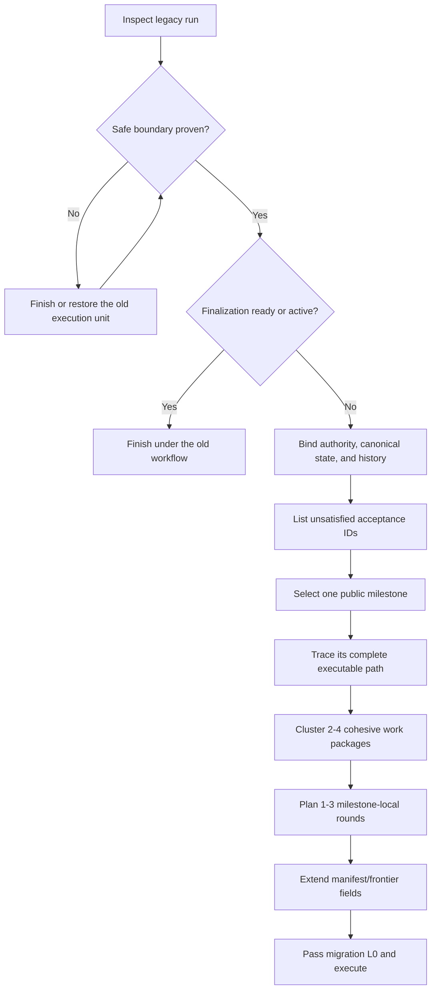

# Temporary Migration Guide: Legacy Full Runs to Milestone Execution

**Status:** Temporary operator overlay
**Date:** 2026-07-25
**Scope:** Existing Full runs created from a static plan or progressive frontiers
**Excluded:** Leave-Undo, automatic abandonment, round-triggered rollback, and a feature-wide static DAG

## Purpose

Use this guide to move an existing Full run into milestone-oriented execution without rewriting product authority, relabeling old evidence, or changing an in-flight boundary.

The target keeps Full assurance at feature level while execution uses user-visible milestones, cohesive work packages, one to three rounds of milestone-local lookahead, package L1, public-entry milestone L2/E2E, and finalization-only L3.

This temporary overlay supplements the [progressive SDD workspace design](../specs/2026-07-22-progressive-sdd-workspace-design.md) only for migration and decomposition. Existing safety, patch admission, rollback, Review convergence, verification, finalization, and live-effect rules remain authoritative.

## Precedence

Apply instructions in this order:

1. explicit user scope and live/destructive authorization;
2. approved product authority and protected contracts;
3. existing Lite safety, recovery, L0-L3, and finalization rules;
4. this guide for milestone selection and package granularity;
5. superseded task, frontier, correction, or static-plan decomposition.

Migration cannot weaken a protected invariant or authorize an effect.

## Required Rules

- Migrate only at a **safe boundary**: clean identity-bound canonical state, no active writer, unadmitted patch, pending mutation, unresolved Review pass, finalization action, or in-flight effect.
- Reuse sufficient approved authority. Do not repeat brainstorming or approval only because execution representation changes.
- Keep `manifest.json` as the sole runtime index. Do not create another progress file or authority brief.
- A **milestone** is one user-visible acceptance increment with a public entry point and terminal controlled L2/E2E.
- A **work package** is the largest cohesive implementation boundary one writer can self-review and prove with one package L1.
- One **execution round** is a declared package batch followed by canonical integration. Internal RED/GREEN iterations are not separate controller rounds.
- Do not relabel old L1, L2, L3, or Review evidence beyond its exact code, command, and scope.
- Migration does not create a new Review unit or reset a Review budget.
- Do not precompute later milestones.
- Do not add Leave-Undo behavior. A stalled milestone remains an explicit manual decision point.

## Eligibility Matrix

| Current run state | Migrate now? | Action |
|---|---|---|
| New Full objective or approved static plan; no task started | Yes | Bind approved authority and initialize one milestone |
| Progressive run between completed frontiers; clean latest L2 | Yes | Preserve history and derive the next frontier as a milestone |
| Current frontier derived but never dispatched or edited | Yes | Supersede it and derive the milestone |
| Inline writer is active or canonical is dirty | No | Finish or restore the old unit first |
| Parallel workers, patches, or admission are active | No | Collect, quarantine, admit, or reject under old rules first |
| Candidate source is ready but not admitted | No | Finish old parent L1/L2 admission or recovery first |
| Review or correction is pending | No | Finish that exact bounded Review unit first |
| Review PASS completed after the parent stopped | Conditional | Verify persisted result, candidate identity, and scope; then close the old unit |
| Finalization is ready or active | No | Finish under the old finalization path |
| Live/destructive effect is active | No | Finish old effect handling and post-effect evidence |
| Environment-only acceptance is externally blocked | Conditional | Preserve valid work and record the block; never fabricate evidence |

## Migration Flow



## Procedure

### 1. Close the Old Boundary

Read the approved authority, current manifest/frontier, accepted commits, canonical identity, active fleet, patch/admission state, Review state, deferred effects, and referenced L1/L2/L3 evidence.

Before migration, record:

- canonical `HEAD`, tree, and clean status;
- authority commit and relevant content hashes;
- current or latest completed frontier;
- no active worker or unresolved patch;
- no pending Review/correction;
- no finalization or live effect in flight;
- latest passing L2 identity.

Missing or uncertain identity blocks migration. Complete or restore the old unit with its existing recovery rules; never change an active unit in place.

### 2. Reuse Authority and List Remaining Acceptance

Use existing authority when it already defines outcomes, acceptance IDs, hard constraints, non-goals, protected invariants, and effect authorization. Amend authority only for a real product or protected-contract change.

Create a short controller table:

| Acceptance ID | Public entry point | Exact current evidence | Remaining observable gap |
|---|---|---|---|
| `<id>` | `<command/API/workflow>` | `<evidence or none>` | `<missing behavior>` |

Commits, modules, tests, and completed frontier counts are not acceptance progress.

### 3. Select and Trace One Milestone

Choose the earliest high-value acceptance increment that can end in real public-entry L2/E2E. Record:

- acceptance IDs;
- public command, API, or workflow;
- terminal controlled scenario;
- observable receipt or effect;
- consumed protected contracts;
- explicit exclusions for later milestones.

Do not use `implement parser`, `add schema`, `add lock`, or `build helper` as a milestone. Trace the complete production path instead, for example:

```text
CLI -> workspace/run -> environment probe -> adapter/helper
-> validation/admission -> persistence/live state -> public receipt
```

This is bounded lookahead for the current milestone, not a whole-feature plan.

### 4. Form Work Packages and Rounds

Keep behavior in one package when it shares an acceptance path, transaction, state transition, fixture, failure model, or modules likely to change together. Split only when interfaces are stable, ownership/resources are separable, package L1 is independent, and concurrency materially reduces the critical path.

Enabling packages may run in parallel even when they are not independently user-visible, provided they are independently mergeable under a frozen consumed interface. A package may own several source and test files and perform its complete internal TDD loop.

Plan one to three rounds for the milestone:

```text
Round 1: protected capability and independent enabling packages
Round 2: public integration and terminal controlled E2E
Round 3: only for one unavoidable remaining dependency layer
```

Do not create later milestone tasks. If the declared rounds end without acceptance, mark the milestone stalled and request a manual process decision. This guide defines no automatic discard, revert, extension, or rename.

### 5. Carry Existing Work Forward Honestly

| Existing artifact | Treatment |
|---|---|
| Approved authority or unchanged protected contract | Reuse as authority |
| Accepted commit consumed by the milestone | Reuse as canonical implementation |
| Passing L1 at identical commit and command | Supporting baseline evidence |
| Old L2 without the new public E2E | Historical affected-closure evidence only |
| Review PASS with unchanged candidate and scope | Reuse for that exact package or old boundary |
| Review with changed code, contract, or scope | Historical only |
| Failed/rejected patch | Forensic history only |
| Stale task card or authority brief | Superseded decomposition; do not copy |
| Matching reusable L3 | Follow existing strict reuse rules; normally finish old finalization |

Do not rerun focused evidence without invalidation, but always run the new milestone's terminal public L2/E2E.

### 6. Extend the Existing Runtime Representation

Keep all fields required by current skills. Add a temporary overlay to `manifest.json` rather than a new ledger:

```json
{
  "workflowOverlay": {
    "name": "temporary-full-milestone-v1",
    "guide": "docs/superpowers/migrations/2026-07-25-temporary-full-milestone-workflow-migration.md",
    "sourceWorkflow": "progressive-frontier",
    "migratedAtSafeBoundary": true,
    "leaveUndoEnabled": false
  },
  "currentFrontier": "M002-observe-region"
}
```

Treat the current frontier as the milestone container and add fields while preserving existing ownership, resource, L0/L1/L2, status, and identity fields:

```json
{
  "kind": "user-visible-milestone",
  "acceptanceDelta": ["A-E2E-CONTROLLED-WINDOW:observe-region"],
  "publicEntrypoint": "cu observe --region",
  "terminalE2E": "controlled target/decoy region capture",
  "plannedRoundCount": 2,
  "workPackages": [
    {
      "id": "filesystem-safety",
      "executionTier": "protected-contract",
      "round": 1,
      "taskCard": "tasks/P001-filesystem-safety.md"
    },
    {
      "id": "capture-admission",
      "executionTier": "isolated-parallel",
      "round": 1,
      "taskCard": "tasks/P002-capture-admission.md"
    },
    {
      "id": "windows-capture-adapter",
      "executionTier": "isolated-parallel",
      "round": 1,
      "taskCard": "tasks/P003-windows-capture-adapter.md"
    },
    {
      "id": "archive-live-cli-integration",
      "executionTier": "routine-inline",
      "round": 2,
      "taskCard": "tasks/P004-archive-live-cli-integration.md"
    }
  ]
}
```

Map every package exactly once to an execution tier, a round from one through `plannedRoundCount`, and its current task card. Every declared round has at least one package. Broaden task cards to cohesive boundaries instead of one card per parser, record, or helper function. Do not add a static feature DAG, `progress.md`, duplicate authority, or separate migration ledger.

### 7. Run Migration L0

Before implementation resumes, prove:

- authority, contract, canonical, and carried-evidence identities match;
- no old worker, patch, Review, finalization, or effect remains active;
- each package has complete ownership, mutable resources, dependencies, and exact L1;
- parallel claims are honest;
- the milestone has a real public entry point and terminal E2E command or harness;
- no old evidence is relabeled beyond its scope.

A failed L0 stops migration. Fix derived migration state inline only when authority and canonical identity remain unchanged.

### 8. Execute With Existing Safety and Review Rules

Migration itself is not a Review unit. Routine packages use TDD, self-review, package L1, and milestone L2. A protected contract may retain or receive its bounded Review before consumers. A prior PASS is reusable only for exact unchanged identity and scope.

The following remain unchanged:

- native patch complete-set preflight and zero partial integration;
- post-apply versus post-commit recovery;
- L0 prerequisite checks, package L1, milestone affected-closure L2, and finalization-only L3;
- state-bound L3 reuse and invalidation;
- bounded Review convergence;
- final whole-change Review;
- live-effect approval and post-effect smoke.

See [review convergence](../specs/2026-07-22-review-convergence-design.md) and the [fail-first execution design](../specs/2026-07-19-fail-first-wave-execution-design.md).

## Example: Current `cu` Run

Assume `F006p` has focused GREEN, a persisted async Review PASS, and an otherwise clean repository.

1. Verify the persisted Review result, exact candidate hashes, and unchanged scope.
2. Finish old F006p parent admission, fresh declared L1/L2, commit, and old-frontier completion.
3. Bind the new clean canonical state; do not reopen earlier F006 reviews.
4. Select `M002-observe-region`.
5. Reuse accepted filesystem safety, strict JSON/observation records, PNG/sidecar/bundle admission, and archive/live primitives.
6. Park effect-journal work for the later `act` milestone.
7. Define remaining packages: Windows capture adapter/fixture, missing archive/live integration, and public `cu observe --region` receipt/E2E.
8. Complete the milestone only when the real command passes the controlled target/decoy scenario.

Do not revert valid F006 commits merely because their original decomposition was too fine. Do not treat their completed-frontier count as proof that `observe` is complete.

## Completion Checklist

- [ ] Safe boundary and exact identities are recorded.
- [ ] Old writers, patches, Reviews, corrections, finalization, and effects are closed.
- [ ] Existing authority is reused without unnecessary re-approval.
- [ ] Unsatisfied acceptance IDs are listed.
- [ ] Exactly one public milestone and terminal E2E are named.
- [ ] Work packages are cohesive and parallel claims are honest.
- [ ] One to three milestone-local rounds are declared.
- [ ] Existing evidence is classified without relabeling.
- [ ] Current required manifest/frontier fields remain valid.
- [ ] Review budgets are not reset.
- [ ] No duplicate progress or authority artifact exists.
- [ ] Leave-Undo is disabled and not implied.
- [ ] Migration L0 passes before implementation resumes.

## Stop and Retirement

Stop migration when authority, canonical identity, evidence identity, ownership, environment, or active-work state is uncertain; when product semantics must change; when no honest public E2E can be named; or when migration would weaken a safety/finalization rule. Continue or close the old workflow at its existing boundary.

Retire this guide when milestone execution is implemented in skills and executable contracts. Do not auto-migrate active temporary-overlay runs; let them finish under this guide, start new runs under the implemented schema, and supersede this file instead of copying it into product authority.
